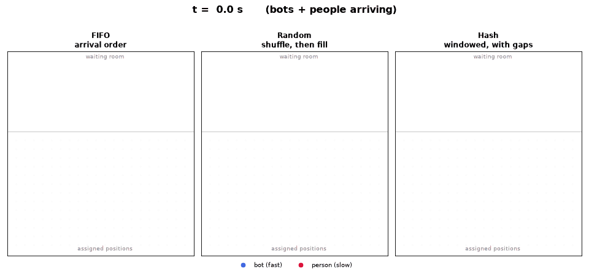

# FairQueue

**A virtual waiting room for nginx where being faster doesn't get you a better spot.**

`ngx_http_fairqueue_module` is a dynamic nginx module for high-demand drops:
concert tickets, sneaker releases, limited stock, exam registration. One
`load_module`, a few directives, and your backend is protected behind a fair,
unpredictable queue. No backend changes.

## The problem

When something scarce goes on sale, thousands of requests hit in the first
second. You have to order them somehow, and the default is *first come, first
served*. It sounds fair. It isn't.

"First" doesn't measure who wants it most, it measures **latency**. A script fires
at millisecond zero, in parallel, from a datacenter next to your server. A person
has to see the page load, move the mouse, click, while their browser negotiates
TLS and runs your JavaScript. By the time a human's request arrives, the bots
already own the front of the line. The queue is *formally* fair and *materially*
rigged toward whoever automates best.

## The idea

Give each visitor a slot that **doesn't depend on when they arrived**. Hash their
identity with a secret, spread the result over a time window sized by how many
people are actually waiting, and admit at a fixed rate:

```
position = floor( HMAC(secret, event + device) · N · (1 + headroom) )
```

Because the slot comes from a hash and not from arrival time, arriving a
millisecond earlier buys nothing. A person who shows up late can still draw a slot
near the front, right between the bots. Speed stops being an advantage; the only
thing that still helps an attacker is controlling *many identities*, and a per-IP
cap turns that into a cost instead of a free win.

<p align="center">
  
</p>

Same population in all three panels (bots burst in first, people trickle in and a
late batch of them piles up in the waiting room). Watch where that red batch ends
up.

## Why not just FIFO, or a shuffle?

Two obvious alternatives, and where each one breaks:

- **FIFO (first come, first served).** Orders by latency, so bots win by
  construction. The late batch of humans lands at the very back — exactly what the
  left panel shows.
- **Shuffle / random.** Tempting, but you can only shuffle the people already in
  the queue, and you have to flush them in batches as the sale runs. The early
  batches are almost all bots, so the front still fills with bots; and when a late
  batch is *all humans*, shuffling it changes nothing — they're still stuck at the
  back (middle panel). Randomness without reserved space ahead can't move a
  latecomer forward.
- **Hash in a window (FairQueue).** The window is sized to the waiting population
  *with headroom*, so it always has gaps ahead. A latecomer's slot is computed, not
  drawn from the tail, so it can land in one of those reserved holes near the front
  (right panel). That's the difference: FIFO and shuffle can only append; a hashed
  window can *place*.

The animation is generated by
[`notebook/make_animation.py`](notebook/make_animation.py); the full statistical
argument is in [`notebook/fairqueue_distribution.ipynb`](notebook/fairqueue_distribution.ipynb).

## What it is (and isn't)

- **No speed advantage** — your slot is `HMAC(secret, event + device)`, not your
  arrival time.
- **Backend protection** — admissions are metered by `rate`; no stampede, no
  backend changes.
- **Abuse turns into cost** — a per-IP device cap and an optional, pluggable risk
  signal make volume expensive instead of blocking it.

FairQueue is admission-control infrastructure, not a bot detector. Bot detection
is kept deliberately simple; integrators plug in their own signals through the risk
hook.

## Install

Ships as a `.deb` for Ubuntu/Debian. Installing it drops a `load_module` line into
`modules-enabled/`, so nginx picks the module up automatically.

### Download the .deb (GitHub Releases)

```sh
# grab the latest .deb from the releases page, then:
sudo apt install ./nginx-module-fairqueue_*.deb
nginx -t
```

Releases: https://github.com/joelibaceta/ngx_http_fairqueue_module/releases

### apt (Launchpad PPA) — coming soon

```sh
sudo add-apt-repository ppa:joelibaceta/fairqueue
sudo apt update
sudo apt install nginx-module-fairqueue
```

### Any nginx (compile-on-install)

No prebuilt package for your nginx? Build just the module against your installed
nginx (not a full nginx):

```sh
git clone https://github.com/joelibaceta/ngx_http_fairqueue_module
sudo sh ngx_http_fairqueue_module/module/install.sh --enable
```

See [`module/BUILD.md`](module/BUILD.md) to build the `.so` by hand.

## Configure

```nginx
load_module modules/ngx_http_fairqueue_module.so;   # (auto-enabled by the package)

http {
    fairqueue_zone zone=tickets:32m rate=500r/m;

    server {
        location /checkout {
            fairqueue           tickets;
            fairqueue_secret    "change-me";            # required
            fairqueue_start     1735740000;             # sale start (epoch)
            fairqueue_waiting_uri /waiting-room;
            proxy_pass http://backend;                   # untouched
        }

        # read-only JSON the waiting page polls for position/ETA
        location = /__fairqueue/status {
            fairqueue        tickets;
            fairqueue_status;
            fairqueue_secret "change-me";
            fairqueue_start  1735740000;
        }
    }
}
```

| Directive | Default | Purpose |
|---|---|---|
| `fairqueue_zone zone=N:SIZE [rate=..]` | — | shared-memory zone (http context) |
| `fairqueue NAME` | — | enable on a location, binding a zone |
| `fairqueue_status` | — | serve the read-only status JSON here |
| `fairqueue_secret <str>` | — | **required**; keys all signatures |
| `fairqueue_rate 500r/m` | 500r/m | admission rate (`r/s`, `r/m`, `r/h`) |
| `fairqueue_start <epoch>` | 0 | sale start (no one admitted before it) |
| `fairqueue_waiting_start <epoch>` | 0 | registration opens (queue forms, cursor frozen) |
| `fairqueue_waiting_uri <uri>` | /waiting-room | where waiters are redirected |
| `fairqueue_token_ttl <sec>` | 300 | admission token lifetime |
| `fairqueue_penalty <0..1>` | 0.02 | volume penalty as a fraction of N |
| `fairqueue_aging <pos/sec>` | 0.5 | penalty recovered per second waited |
| `fairqueue_aging_cap <0..1>` | 0.1 | cap on aging (fraction of the window) |
| `fairqueue_window_headroom <0..1>` | 0.2 | slack so the window is not fully packed |
| `fairqueue_allocation hash\|fifo` | hash | slot strategy (fifo is a baseline) |
| `fairqueue_scope <str>` | default | binds the token to this queue |
| `fairqueue_risk_header <name>` | — | external risk score 0..1 (trusted upstream) |
| `fairqueue_risk_weight <0..1>` | 0.5 | weight of the risk score |
| `fairqueue_max_devices_per_ip <n>` | 64 | per-IP cap on active devices |
| `fairqueue_trust_xff on\|off` | off | read the client IP from X-Forwarded-For |
| `fairqueue_cookie_secure on\|off` | off | add `Secure` to cookies (enable over HTTPS) |

## How it works

```
position = floor(frac * N * (1 + headroom)) + max(0, penalty - aging)
cursor   = rate * (now - sale_start)
admitted ⟺ now >= sale_start AND position <= cursor
```

`frac` is the device's keyed hash; `N` is the live count of active participants.
Admission walks the cursor forward at `rate`; waiting requests are redirected to
the waiting page, which polls `/__fairqueue/status` and sends the visitor through
once it is their turn. The decision is entirely server-side: the status JSON and
its JavaScript are UX only — the signed admission token is the sole authority.

## Layout

```
module/
  ngx_http_fairqueue_module.c   the module
  config                        nginx add-module build glue
  install.sh                    compile-on-install helper
  debian/                       source package for the PPA
  BUILD.md                      build-from-source instructions
  ci/                           verification harnesses (not shipped)
```

## Contributing / tests

The design's core principles are encoded as black-box **invariant tests** in
[`module/ci/invariants.sh`](module/ci/invariants.sh): no admission before the
sale, a frozen per-device slot (speed/refresh buy nothing), admission bounded by
the rate, the per-IP cap, fail-closed secret, unforgeable cookies, scoped tokens,
and a read-only status endpoint. CI ([`.github/workflows/ci.yml`](.github/workflows/ci.yml))
runs them on every push and pull request and builds the `.deb`, so a change that
breaks a principle fails the build regardless of how the C was written.

Run them locally (needs Docker):

```sh
docker run --rm -v "$PWD/module":/module alpine:3.20 sh /module/ci/invariants.sh
```

## License

MIT.

